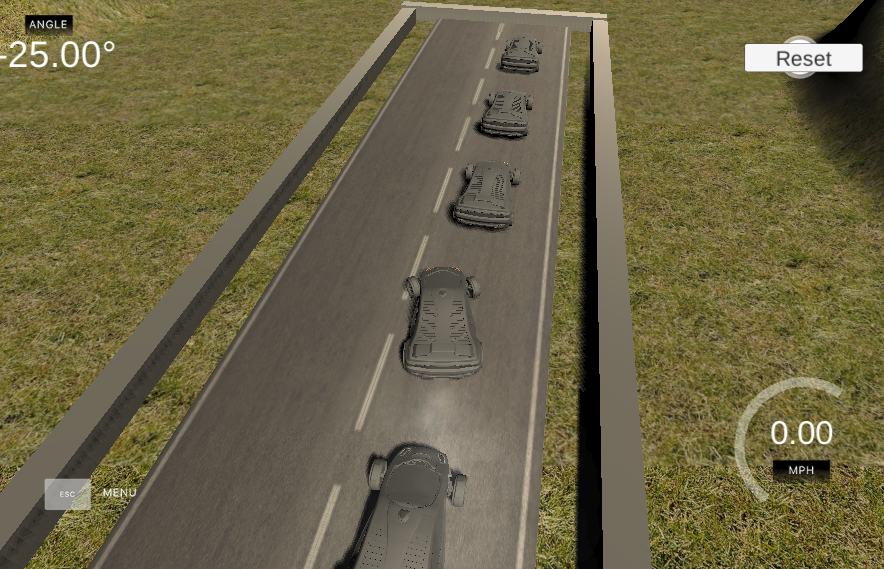
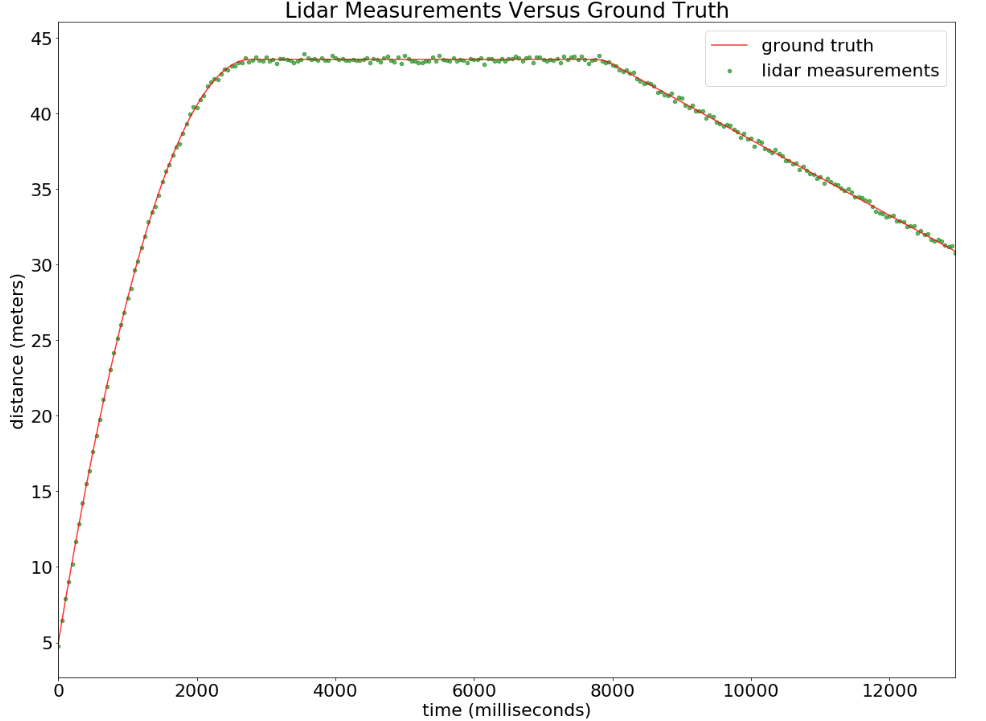
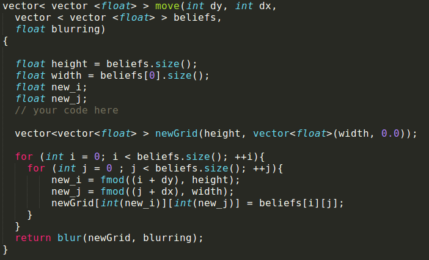
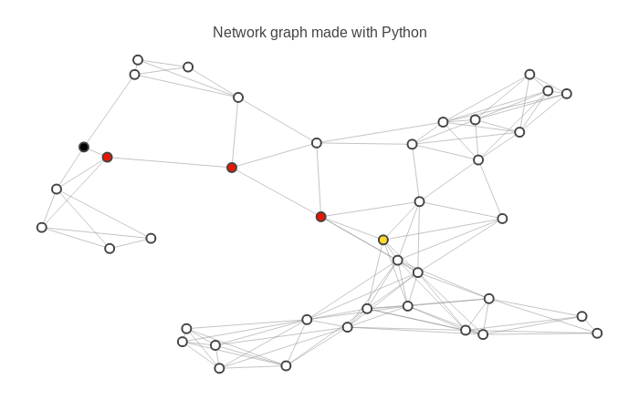
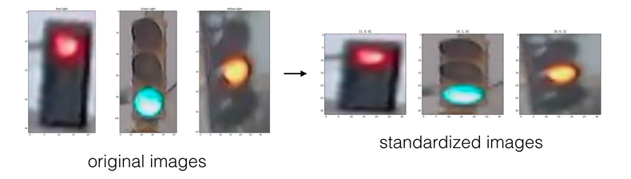
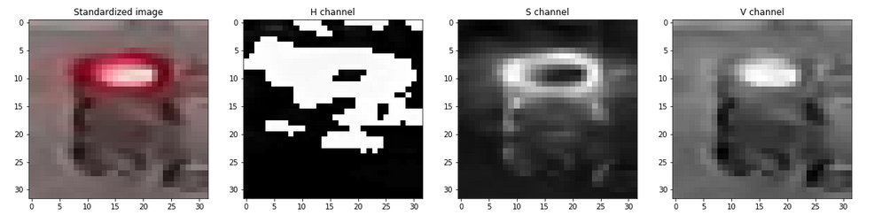

# INTRO TO SELF-DRIVING CAR NANODEGREE

# Projects

### These are my submission projects for the ISDC Nanodegree

## [Project 0: Joy Ride](./Joy_Ride/jupyterwork/Car.py) 

**Jump​ ​into​ ​writing​ ​code​ ​that​ ​controls​ a ​simulated​ ​vehicle.​ ​Send​ ​ throttle​ ​ and​ ​steering​ ​commands​ ​to​ ​the car​ ​to​ try​ and​ ​get​ ​it​ ​to​ ​navigate​ around​ ​a ​test​ ​track.**

#### Project rubric :
* The `park`function causes the car to parallel park in the right lane without going off the road or hitting any of the other vehicles.

***

## [Project 1: Implement​ ​a ​Matrix​ ​Class](./Implement_a_Matrix_Class/home/kalman_filter_demo.ipynb)

**In​ this​ ​project​ ​you’ll​ ​practice​ ​using​ ​your​ ​object​ ​oriented​ ​programming​ ​and​ ​matrix​ ​math​ ​skills​ ​by filling​ ​out the​ methods​ in​ ​a ​partially-completed​ ​`Matrix`​ class**

#### Project rubric :

* If your code passes the provided tests in `test.py` then your project will meet specification for this criteria.

* `determinant()`, `trace()`, `inverse()`, `T() (transpose)` of matrix are calculated the right way and we get the correct output.

* `add()`, `neg()`, `sub()`, `mul()`, `rmul()` are calculated the right way and we get the correct output.

* Code quality issues should not make a project non-passing unless they are problematic enough that it is not possible to understand the code at all with a reasonable amount of effort. 

*** 

## [Project 2: Translate​ Python​ ​to​​ C++](./Translate_Python_to_C++)

**​The​ goal​ for​ this course​ ​is​ ​translation:​ given​ ​a ​program​ written​ ​in​ ​Python,​ ​you’ll​ ​apply​ ​your knowledge​ of​ ​C++​ ​syntax​ ​by​ ​translating​ ​the​ ​Histogram​ ​Filter​ ​code​ ​from the​ ​first​ ​course​ ​into​ ​C++.**

#### Project rubric :
* Code passes the provided tests in `tests.cpp`

* `'initialize_beliefs'` is implemented the right way.

* `'sense'` is implemented the right way.

* `'move'` is implemented the right way.

* Code quality issues should not make a project non-passing unless they are problematic enough that it is not possible to understand the code at all with a reasonable amount of effort. 

***

## [Project 3: Implement Route Planner (A* Algorithm)](./Implement_Route_Planner/home/project_notebook.ipynb)

**In this project, you will build a route-planning algorithm like the one used in Google Maps to calculate the shortest path between two points on a map.**

#### Project rubric :

* Running `test.py` shows "all tests pass".

* The student implements all required methods. (New Version). 
   
* The `heuristic function` used to estimate the distance between two intersections is guaranteed to return a distance which is less than or equal to the true path length between the intersections.

* Student answered all question correctly. (New Version Only)

* Code avoids obvious inappropriate use of lists and takes advantage of the performance improvement afforded by sets / dictionaries where appropriate. For example, a data structure like the `"open_set"` on which membership checks are frequently performed (e.g. if node in `open_set`) should not be a list. 

***  

## [Project 4: Traffic Light Classifier](./Traffic_Light_Classifier/home/Traffic_Light_Classifier.ipynb)

**In this project, you’ll use your knowledge of computer vision techniques to build a classifier for images of traffic lights! You'll be given a dataset of traffic light images , pre-process these images, extract features and use those features to classify the traffic light images into three categories: red, yellow, or green.**

#### Project rubric :

* In the project notebook, all questions are answered.

* All input images (before they are classified) should be processed so that they are the same size.

* All labels should be a one-hot encoded vector of length 3. Ex. ‘yellow’ becomes: `[0, 1, 0]`.

* Using `HSV colorspace`, extract a feature from a traffic light image that represents the level(s) of brightness in an image. This feature can help classify any traffic light image. A feature can be a list, array, or a single value.

* Using any created features, write a classification function that takes in a standardized `RGB` image and outputs whether a traffic light is red, yellow, or green as a one-hot encoded label.

* The model must have greater than `90%` accuracy on the given test set.

* In the given test set, red traffic lights can never be mistakenly labeled as green.

